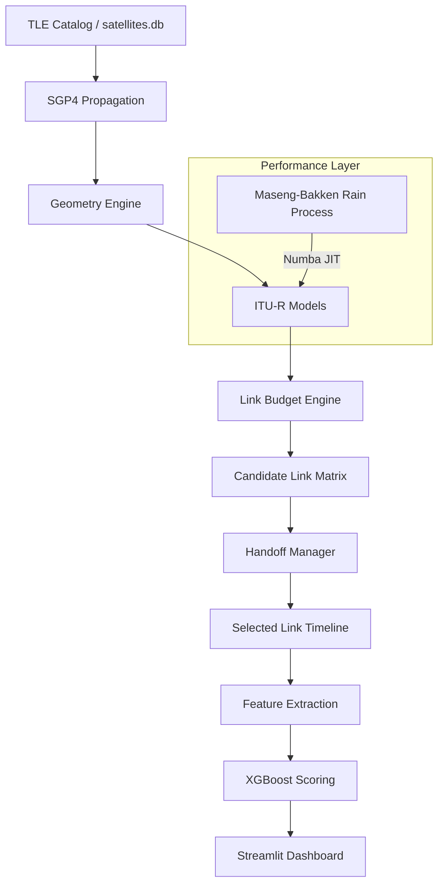

# System Architecture

The simulator is designed for scalable simulation workloads through vectorization, concurrency, and parallel execution. It operates as a high-fidelity time-series engine, bridging the gap between orbital mechanics and link-layer performance.

## Architecture Diagram

## Core Modules (Clean Architecture)
The codebase follows a Clean Architecture layout to strictly separate domain physics from application orchestration and external infrastructure:
- **`src/satlinksim/domain/`**: Contains pure physical models, link budget math, geometric transformations, and core data structures (`models.py`). This layer has no external dependencies.
- **`src/satlinksim/application/`**: Contains the `SimulationEngine`, orchestrating domain logic to fulfill batched, concurrent, and Monte Carlo simulation requests.
- **`src/satlinksim/infrastructure/`**: Handles external integrations, including the Streamlit dashboard (`ui/`), SGP4 TLE propagation (`tle/`), database persistence (`persistence/`), and ML model training/inference (`ml/`).
- **`src/satlinksim/ground_stations.py`**: Single source of truth for station parameters.
*(Note: Compatibility wrappers exist in the root module to support legacy scripts).*

## High-Performance Engineering
The simulator utilizes a multi-tier optimization strategy to handle large-scale satellite constellations:
- **Numba JIT Compilation**: The Maseng-Bakken AR(1) rain synthesis engine is JIT-compiled into a machine-code kernel, achieving a **~192x speedup** over interpreted Python.
- **NumPy Vectorization**: Link budget and atmospheric calculations are processed as matrix operations, significantly reducing Python overhead.
- **Async Concurrency**: Asyncio coordinates concurrent propagation workflows for multi-station simulations.
- **Multiprocessing**: Monte Carlo iterations are distributed across CPU cores using `ProcessPoolExecutor`.

*Note: Performance figures are derived from the [Benchmark Suite](benchmarks.md).*

## The Timestep Simulation Loop
The core of the simulator is a stateful time-series engine. For each timestep in the simulation window:

1. **Propagate**: Update candidate satellite ECEF states using SGP4 orbital kernels.
2. **Handoff**: Evaluate switching logic (Hysteresis/Dwell) to select the optimal active satellite.
3. **Geometry**: Recompute range, elevation, and Doppler shift for the selected satellite.
4. **Atmospheric Models**: Evaluate frequency- and angle-dependent losses (FSPL, Gas, Scintillation).
5. **Rain Dynamics**: Advance the Maseng-Bakken correlated rain process (AR(1)) using a **JIT-accelerated kernel**.
6. **Link Budget**: Consolidated SNR calculation including hardware gains and noise floor.
7. **Aggregate**: Collect time-series metrics (SNR, packet loss) for final scoring.

## Simulation Workflow
1. **Initialize**: Load satellite TLEs and ground station parameters from SQLite.
2. **Parallel Execution**: Distribute independent simulation workloads across available CPU cores for large-scale availability studies.
3. **Matrix Processing**: Apply vectorized atmospheric models across the entire time series.
4. **ML Inference**: Extract features and score the station using the pre-trained XGBoost model.
5. **Dashboard Rendering**: Present interactive charts and comparative rankings in the UI.
