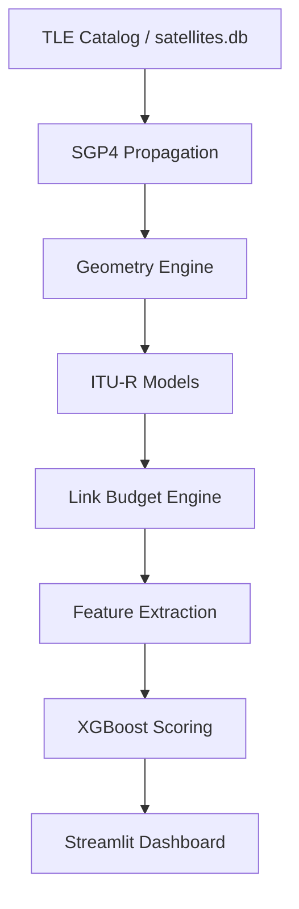

# System Architecture

The simulator is designed for scalable simulation workloads through vectorization, concurrency, and parallel execution. It operates as a high-fidelity time-series engine, bridging the gap between orbital mechanics and link-layer performance.

## Architecture Diagram

## Core Modules
- **`app.py`**: Streamlit dashboard providing UI controls, scoring, and visualization.
- **`satellite_link_sim.py`**: High-performance ITU-R physics engine.
- **`propogate.py`**: SGP4 Propagation Layer with async support.
- **`ground_stations.py`**: Single source of truth for station parameters.

## High-Performance Engineering
The simulator has transitioned from a scalar loop to a **vectorized matrix engine** to achieve significant performance gains:
- **NumPy Vectorization**: Link budget calculations are processed as matrix operations, achieving a **~10x speedup** over scalar implementations.
- **Async Concurrency**: Asyncio coordinates concurrent propagation workflows for multi-station simulations.
- **Multiprocessing**: Monte Carlo iterations are distributed across CPU cores using `ProcessPoolExecutor`, achieving a **~2.5x speedup** on typical 8-core systems.

*Note: Performance figures are derived from the [Benchmark Suite](benchmarks.md).*

## The Timestep Simulation Loop
The core of the simulator is a stateful time-series engine. For each timestep in the simulation window:

1. **Propagate**: Update satellite ECEF state using SGP4 orbital kernels.
2. **Geometry**: Recompute range, elevation, and Doppler shift based on relative motion.
3. **Atmospheric Models**: Evaluate frequency- and angle-dependent losses (FSPL, Gas, Scintillation).
4. **Rain Dynamics**: Advance the Maseng-Bakken correlated rain process (AR(1)) to model fade persistence.
5. **Link Budget**: Consolidated SNR calculation including hardware gains and noise floor.
6. **Aggregate**: Collect time-series metrics (SNR, packet loss) for final scoring and visualization.

## Simulation Workflow
1. **Initialize**: Load satellite TLEs and ground station parameters from SQLite.
2. **Parallel Execution**: Distribute independent simulation workloads across available CPU cores for large-scale availability studies.
3. **Matrix Processing**: Apply vectorized atmospheric models across the entire time series.
4. **ML Inference**: Extract features and score the station using the pre-trained XGBoost model.
5. **Dashboard Rendering**: Present interactive charts and comparative rankings in the UI.
