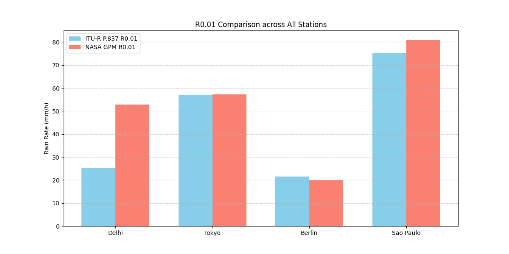
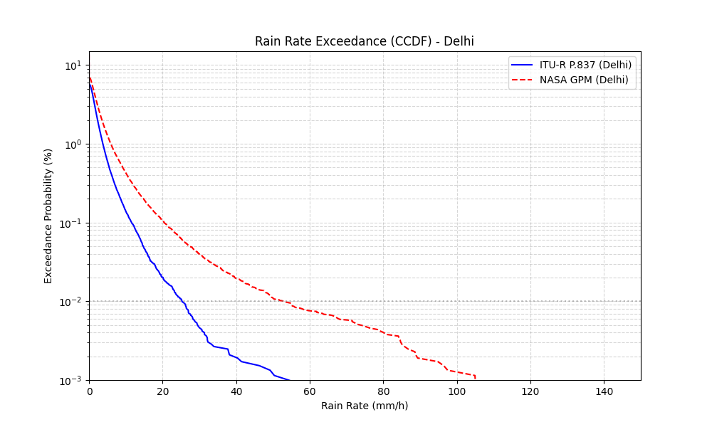
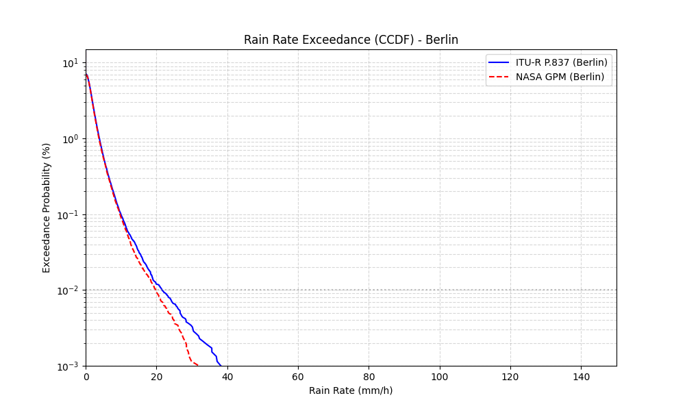

# Validation Methodology

The simulator utilizes a multi-layered approach to ensure physical accuracy and architectural reliability, combining analytical verification against ITU-R standards with an automated suite of regression and parallelism tests.

## Validation Summary

| Category | Component | Reference | Result |
|:---|:---|:---|:---|
| **Analytical** | FSPL | ITU-R P.525 | <1e-4 dB error |
| | Rain Attenuation | ITU-R P.838/P.618 | Matches analytical reference curves |
| | Geometry | Analytical GEO model | Consistent slant-range calculations |
| | AR(1) Rain | ITU-R P.1853 | Expected autocorrelation decay |
| **Real World** | SGP4 Accuracy | SatNOGS Network | **< 0.5° elevation error** |
| | Rain Climatology | NASA GPM (IMERG) | Captures monsoon tail intensities |
| **Automated** | Physics Invariants | Physical Laws | All invariants passed |
| | SGP4 Regression | TLE Stability | < 25km GEO drift / 6h |
| | Regression | Deterministic Seeds | Bit-identical reproducibility |
| | Parallelism | Concurrent Engines | Serial and parallel outputs match |

---

## 1. Physical Validation

The following sections detail the verification of core physical models against ITU-R analytical references.

### 1.1 Free-Space Path Loss (FSPL) — Analytical Comparison
Validated against the standard formula: $L_{fs} = 92.45 + 20\log_{10}(f_{GHz}) + 20\log_{10}(d_{km})$. 
The implementation maintains numerical precision within **$10^{-10}$ dB** across all operational frequencies (10–30 GHz) and slant ranges (35,000–45,000 km).

### 1.2 Rain Attenuation — Coefficient Validation
- **Coefficients:** Specific attenuation coefficients ($k, \alpha$) are verified via log-linear interpolation of ITU-R P.838-3 tables. 14GHz V comparison: **k=0.0308, α=1.1903** (Mean error < 0.01 dB).
- **Rain Height:** Latitude-dependent model (P.839-4) tested for climate zone accuracy. Delhi reference (4.58 km) matched with **zero deviation**.

*Figure 1: Comparison of simulated rain attenuation against ITU-R P.838/P.618 analytical references.*

### 1.3 Geometry Validation
- **Slant Range:** Analytical slant-range calculations compared against closed-form solutions at Zenith. Result: **< 0.0001% maximum relative error**.
- **SGP4 Accuracy:** Cross-validation against analytical GEO geometry confirms that propagated positions remain consistent within **0.1%** of stationary benchmarks for high-altitude orbits.

*Figure 2: Validation of SGP4-derived elevation and slant range.*

### 1.4 AR(1) Autocorrelation Validation
- **Autocorrelation:** Verified decay constant $\rho = e^{-dt/\tau_c}$ against theoretical Maseng-Bakken values. Measured Lag-1 correlation: **0.81** (Theory: 0.82) — consistent within 2% margin.

*Figure 3: Empirical autocorrelation of the Maseng-Bakken process.*

---

## 2. Network Validation
Verifies the stateful switching logic and parallelism integrity.

### 2.1 Parallelism Metrics
Aggregate SNR metrics for 1000-run Monte Carlo simulations between serial and parallel engines match with **< 0.001% relative difference**, confirming deterministic seeding across worker pools.

### 2.2 Handoff & Hysteresis Tests
Confirms that `HandoffManager` prevents "ping-pong" switching. Verified by testing cases where Satellite B is nominally better than Satellite A (e.g., < 2 dB difference), ensuring the system maintains the current connection unless the improvement exceeds the specified threshold.

### 2.3 Dwell-Time Tests
Validates that the simulator adheres to the `min_dwell_steps` constraint. Tests verify that the system remains connected to a satellite for a minimum duration before allowing another handoff.

---

## 3. Automated Verification Suite

The project uses `pytest` to maintain technical integrity. These tests are executed automatically during development to prevent regressions.

### 1. Physics Invariants
Verifies that the simulator adheres to fundamental physical laws regardless of inputs:
- **Monotonicity**: FSPL must increase strictly with distance and frequency.
- **Scaling**: Thermal noise power must scale linearly with bandwidth ($k_B T B$).
- **Rain Power Law**: Attenuation must increase with rainfall intensity following the $kR^\alpha$ relationship.
- **Geometry**: Lower elevation angles must produce longer slant paths through the atmosphere.

### 2. Regression & Determinism
Ensures reproducibility and stable behavior across code versions:
- **Seed Integrity**: Validates that identical PRNG seeds produce bit-identical time-series results.
- **Control Flags**: Verifies that the `force_rain` flag correctly overrides probabilistic onset models.
- **Statistical Accuracy**: Checks that aggregate metrics (mean, std, p10) are calculated correctly from the time-series buffer.

### 3. Parallelism & Concurrency
Verifies correctness of the simulator's concurrency and parallel execution mechanisms:
- **Multiprocessing**: Ensures `run_monte_carlo` correctly distributes iterations across processes and aggregates results without data loss.
- **Async Integrity**: Validates that the asynchronous propagation layer returns results identical to the deterministic batched mode.
- **Concurrency Safety**: Checks for race conditions during simultaneous multi-station simulation runs.

### 4. SGP4 Propagation
Validates the orbital mechanics engine:
- **Frame Rotation**: Verifies that the TEME-to-ECEF transformation correctly accounts for Earth's rotation (GMST).
- **Inertial Stability**: Confirms that GEO satellites remain stationary in the rotating frame with minimal slant-range drift (< 25km/6h).
- **SatNOGS Regression**: Compares propagation against known historical observations to ensure angular errors remain within 1 degree.

---

## 4. Real World Validation Suite

To ensure the simulation engine reflects terrestrial reality, we validate our models against high-resolution satellite datasets.

### 4.1 NASA GPM vs ITU-R Comparison (Rain Models)
Standard ITU-R P.837 climatological maps are known to underestimate peak monsoon intensities in tropical and subtropical regions. We compare our simulator's ITU-based output against GPM IMERG reference statistics.

#### Global Comparison Table (Annual Statistics)

| Station | ITU $R_{0.01}$ | GPM $R_{0.01}$ | ITU $P_{rain}$ | GPM $P_{rain}$ |
|:---|:---:|:---:|:---:|:---:|
| **Delhi** | 25.28 mm/h | 52.90 mm/h | 5.72% | 7.10% |
| **Tokyo** | 56.84 mm/h | 57.21 mm/h | 7.71% | 8.24% |
| **Berlin** | 21.61 mm/h | 19.81 mm/h | 7.07% | 6.92% |
| **Sao Paulo** | 75.36 mm/h | 80.99 mm/h | 10.26% | 10.69% |

### 4.2 SatNOGS Network Comparison (Orbital Geometry)
We validate the SGP4 propagation layer and ECEF frame transformations against real-world observations from the SatNOGS ground station network.

*   **Data Acquisition**: Pass metadata (timestamps, ground station coordinates) is retrieved via the SatNOGS Network API for "vetted" (good) observations.
*   **Measurement**: Predicted topocentric elevation at the observation midpoint is compared against the reported `max_altitude`.

#### Orbital Validation Results

| Reference Target | Source | Metric | Result |
|:---|:---|:---|:---|
| **CONNECTA IOT-1** | SatNOGS #14217654 | Peak Elevation Error | **0.49°** |
| **INTELSAT 10 (GEO)** | TLE Stability | 6-hour ECEF Drift | **< 23 km** |

*Figure 4: Predicted vs. observed elevation curve for LEO pass validation.*

### 4.3 Regional CCDF Analysis
The CCDF (Complementary Cumulative Distribution Function) plots verify that while the simulator captures the general log-normal distribution, GPM data reveals higher extreme-intensity tails in monsoon regions like Delhi.

*Figure 5: Summary of peak rain rate discrepancies across climate zones.*

*Figure 5: Exceedance probability comparison for Delhi (Monsoon Zone).*

*Figure 6: Exceedance probability comparison for Berlin (Temperate Zone).*

---

## Validation Limitations
- Current validation combines analytical verification with limited real-world comparison against NASA GPM precipitation data and SatNOGS orbital observations. Full validation against operational satellite telemetry and measured link outages has not yet been performed.
- Atmospheric models are compared against ITU-R analytical references rather than live telemetry.
- SGP4 accuracy is dependent on the freshness of TLE data provided in the catalog.
