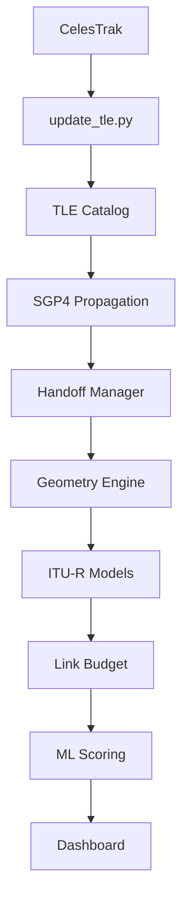

# Multi-Satellite Constillation Link Quality Simulator
High-fidelity satellite communication simulator combining
orbital propagation, atmospheric attenuation modeling, and
stochastic rain fading to evaluate  link performance across dynamic constellations.

Physics-first satellite link simulator integrating:
- **Constellation Management**: Support for multi-satellite systems with dynamic handoff logic.
- **SGP4 orbital propagation** (via `sgp4`)
- **ITU-R P.618/P.676/P.837/P.838** atmospheric models
- **Temporally correlated rain fading** (Maseng-Bakken AR(1))
- **XGBoost** link quality prediction

### Highlights
- **275k timesteps/sec** (single-satellite vectorized mode)
- **74k timesteps/sec** (full constellation + handoff mode)
- **1,300+ Satellite Database**: Integrated live CelesTrak TLE updates (OneWeb, Iridium, GEO).
- **Dynamic Handoffs**: State-aware switching based on highest elevation or SNR with hysteresis.
- **Validation suite**: Extensive quantitative reports for physics and network integrity.
- **Interactive Streamlit dashboard**: Multi-sat selection and real-time handoff visualization.

---

### Architecture



---

### Quick Start

```bash
# Install dependencies
pip install streamlit pandas numpy scikit-learn xgboost joblib matplotlib sgp4 requests

# Update satellite database with live TLEs
python3 update_tle.py

# Run the dashboard
streamlit run app.py
```

---

### Key Features
The simulator computes a full high-fidelity link budget at each time step, tracking everything from geometric path loss and gaseous absorption to rapid tropospheric scintillation. It models dynamic LEO/MEO constellations by utilizing live TLE data and SGP4 propagation.

A dedicated **Handoff Manager** handles stateful satellite switching using configurable policies (Highest SNR or Elevation) with built-in hysteresis and minimum dwell-time constraints to prevent rapid connection toggling.

The simulation engine combines NumPy vectorization, async orbital propagation, and multiprocessing-based Monte Carlo execution to support large-scale availability studies while maintaining interactive performance.

---

### Validation & Benchmarks
- **FSPL accuracy**: <1e-4 dB
- **Throughput**: 275k/sec (Single-Sat) | 74k/sec (Constellation)
- **SGP4 latency**: 75µs
- **Memory**: 326MB @ 500k steps
- **Monte Carlo Speedup**: ~2.5x (12 workers)

---

### Repository Structure
```text
├── app.py                  # Dashboard & Parallel UI
├── satellite_link_sim.py   # Vectorized Physics Engine
├── propogate.py            # Async SGP4 Layer
├── update_tle.py           # CelesTrak Live Update Tool
├── ground_stations.py      # Station Database
├── docs/                   # Detailed Documentation
├── tests/                  # Physics & Regression Tests
└── val_and_bench/          # Validation & Benchmarking Scripts
```

---

### Documentation Links
- [Physics Models](docs/physics_models.md)
- [Rain Model (Maseng-Bakken)](docs/rain_model.md)
- [System Architecture](docs/architecture.md)
- [Validation Methodology](docs/validation.md)
- [Benchmark Results](docs/benchmarks.md)
- [References](docs/references.md)
