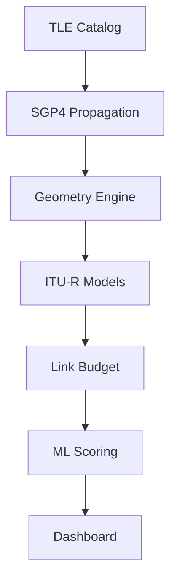

# Satellite Link Quality Simulator

Physics-first satellite link simulator integrating:
- **SGP4 orbital propagation** (via `sgp4`)
- **ITU-R P.618/P.676/P.837/P.838** atmospheric models
- **Temporally correlated rain fading** (Maseng-Bakken AR(1))
- **XGBoost** link quality prediction

### Highlights
- **60,000 timesteps/sec** throughput (Vectorized NumPy engine)
- **<20µs SGP4 propagation latency**
- **Validation suite** against analytical and ITU references
- **Interactive Streamlit dashboard** with parallel execution modes

---

### Architecture



---

### Quick Start

```bash
# Install dependencies
pip install streamlit pandas numpy scikit-learn xgboost joblib matplotlib sgp4 pytest-asyncio

# Run the dashboard
streamlit run app.py

# Run CLI simulation
python3 satellite_link_sim.py
```

---

### Key Features
The simulator computes a full high-fidelity link budget at each time step, tracking everything from geometric path loss and gaseous absorption to rapid tropospheric scintillation. It transitions beyond static GEO assumptions by utilizing live TLE data and SGP4 propagation to model dynamic LEO/MEO constellations.

The simulation engine combines NumPy vectorization, async orbital propagation, and multiprocessing-based Monte Carlo execution to support large-scale availability studies while maintaining interactive performance.

---

### Validation & Benchmarks
- **FSPL accuracy**: <1e-4 dB
- **Throughput**: 60,000 timesteps/sec
- **SGP4 latency**: 18µs
- **Memory**: 122MB @ 500k steps
- **Monte Carlo Speedup**: ~2.5x (12 workers)

---

### Repository Structure
```text
├── app.py                  # Dashboard & Parallel UI
├── satellite_link_sim.py   # Vectorized Physics Engine
├── propogate.py            # Async SGP4 Layer
├── ground_stations.py      # Station Database
├── docs/                   # Detailed Documentation
├── tests/                  # Physics & Regression Tests
└── val_and_bench/          # Validation & Benchmarking Scripts
```

---

### Documentation Links
- [Physics Models](docs/physics_models.md)
- [Rain Model (Maseng-Bakken)](docs/rain_model.md)
- [System Architecture](docs/architecture.md)
- [Validation Methodology](docs/validation.md)
- [Benchmark Results](docs/benchmarks.md)
- [References](docs/references.md)
